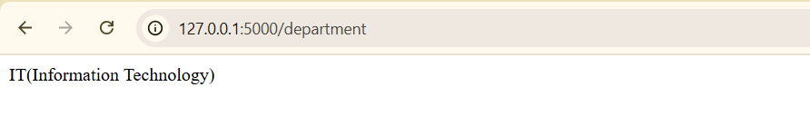

Install the required packages for the ml-model.py:

Output for ml-model.py file:

Python code:

Run the flask api:

Route for name:

Route for Register_number:

Route for Department:

Docker login:

Create the docker images:

Docker images are push into docker hub:

compose.yml for two images:

logs after composing both:

Docker code for personal-api.py file:

Docker code for ml-models.py file:

Docker hub:

Docker containers is running on different PORT like 5003 and 5004:

Output for ML_MODELS.py

